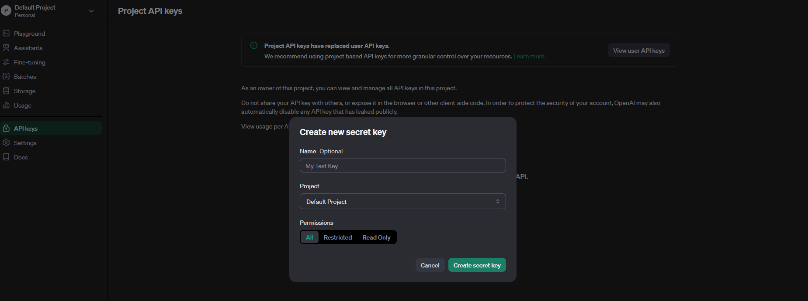
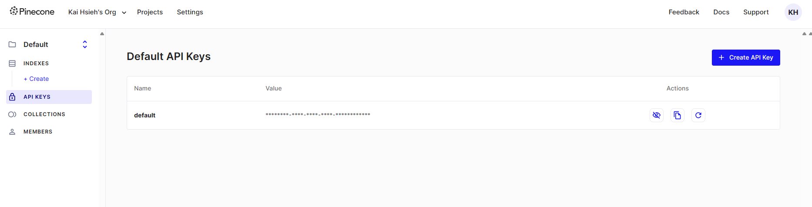

# 進擊的LangChain學習之路: 打造LLM驅動程式的必備技能筆記

## 介紹

- LangChain是框架、接口、代理人
    - LangChain 框架提供給需要與 LLM( Large Language Model ) 互動的程式使用
    - LangChain 提供標準接口給 Chain ，當中包含大量的 tool 及常見的 LLM 。
    - LangChain 設計為 "具有資料感知和主動性" 的代理人，使語言模型能夠與其環境和其他資料來源進行互動。

## 環境建立

### OpenAI API Key 申請

1. 先到 [OpenAI](https://platform.openai.com/) 註冊帳號
2. 然後到 Billing 頁面，填寫方案跟信用卡資訊，目前最低的方案是 5 美元，就付款吧! (如果沒有這個動作，即使你申請了 API Key，也無法使用。另外請注意如果你是在付款前申請的 API Key 也會無效，付款後需要重新申請 API Key 才能使用。)
2. 登入後，在頭像的下拉選單中選擇 `API Keys`，或直接點擊 [這裡](https://platform.openai.com/api-keys)
3. 選擇 `Create new secret key`，並輸入名稱，如 `My test key`，然後點擊 `Create`

4. 複製 `API Key`，並妥善保存。他不會再顯示，所以請記得保存妥當。

### Pinecone Key 申請

1. 先到 [Pinecone](https://www.pinecone.io/) 註冊帳號
2. 當你註冊成功並登入後，在左側會有一個 `API Keys` 的選項，點擊進入
3. 你會發現已經有一個 default 的 key，你可以直接使用，或是新增一個新的 key

4. 我們直接使用 default 的 key，複製 `API Key`，並妥善保存

### SerpApi Google Search API 申請

1. 先到 [SerpApi](https://serpapi.com/) 註冊帳號

2. 他會要你驗證信箱及驗證電話號碼
3. 完成後來到你的 dashboard，你會看到你的 `Your Private API Key`

### 課程提供的 Github Repo

```bash
https://github.com/Heng-xiu/Attack_On_LangChain_Learning_Path.git
```

## LangChain 入門的五個基本技巧

#### Model I/O components 介紹

Model I/O components 是 LangChain 的基本元件，有兩種常見的原件
- [model-LLMs](https://python.langchain.com/docs/modules/model_io/llms/)
    Large Language Models (LLMs) 是 LangChain 的核心元件，他提供很多標準的介面，可以對應到多種不同的 大型語言模型。
- [Chat Models](https://python.langchain.com/docs/modules/model_io/chat/)
    Chat Models 也是 LangChain 的核心元件，他可以用來傳送和接收訊息，就如同使用聊天機器人一樣，只是使用 python 來操作。

- LLM

- Prompt

##### 範例
1. 安裝 langchain-openai
> `--user` 參數是為了安裝在使用者的目錄下，避免需要 root 權限，或是你也可以使用 root 權限安裝
```bash
pip install langchain-openai --user
```
2. 參考以下範例檔案
    - model-module1.py
    - prompt-module1.py
    - prompt-template1.py
    - prompt-template2.py

#### [Chain composition](https://python.langchain.com/v0.1/docs/modules/chains/) 介紹

#### Agent

#### Tool

##### [SerpAPI Tool](https://python.langchain.com/v0.1/docs/integrations/tools/serpapi/)

1. 安裝 google-search-results
```bash
pip install google-search-results --user
```

#### Memory: 賦予 Chain 與 Agents 記憶

